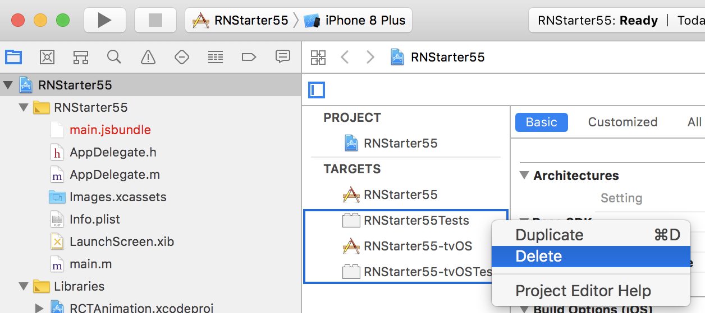
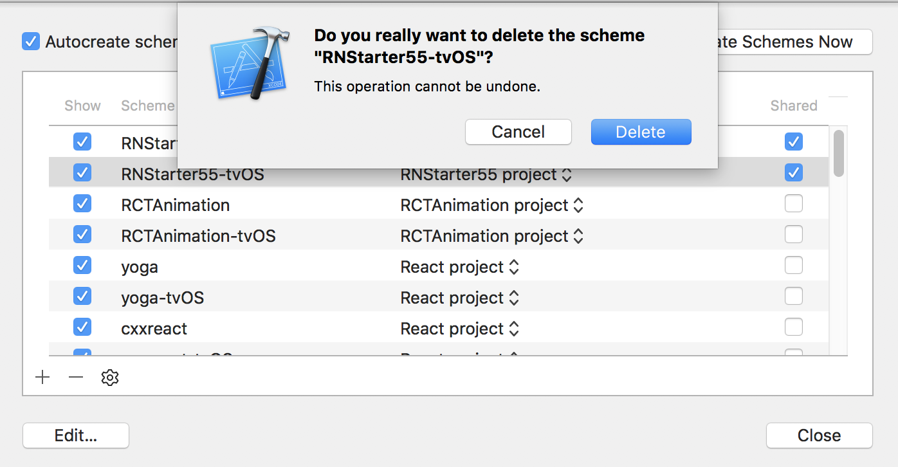
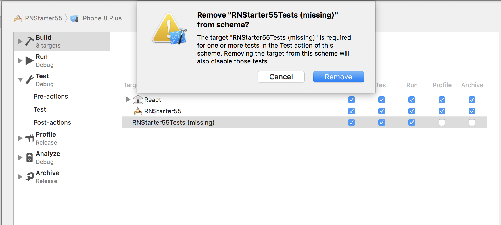
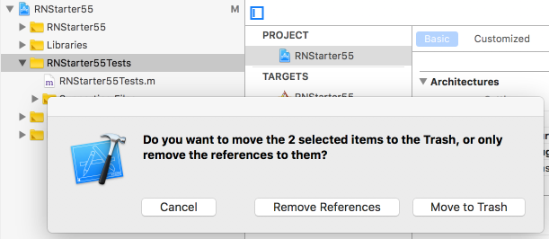

# React Native Boiler Plate

## 1. Initialize a project


**1. Initialize a React Native project with specific version**

`react-native init --version="0.55.4" RNStarter55`

**2. If you are using npm, remove yarn, reinstall node_modules**

````
cd RNStarter55
rm -rf node_modules
rm yarn.lock
npm install
````

**3. Restructure the project**

- Create a folder `src/` in the same level as your `node_modules/`
- Move file `App.js` to `src/`
- Edit `index.js` to point to the correct path: `import App from './src/App';`

**4. Do an initial commit(1)**

````
git init
git add .gitignore # import to do this first, to ignore our files
git add .
git commit -am "Initial commit."
````

**5. Remove Un-needed Xcode targets**

- `cd ios`
- `open RNStarter55.xcodeproj`

- Remove the 3 targets: `RNStarter55Tests`, `RNStarter55-tvOS`, `RNStarter55-tvOSTests`



- From Xcode "Manage Schemes", delete the scheme `RNStarter55-tvOS`



- From Xcode "Edit Scheme", edit the current scheme (`RNStarter55`) and remove the missing target from the Build Step



- Remove the yellow folder RNStarter55Tests ("Move to Trash")



- Manually remove these folders from the `ios` folder: `rm -rf RNStarter55-tvOS/ RNStarter55-tvOSTests/ RNStarter55Tests/`

- Commit(2): `git commit -am "Remove un-needed Xcode targets"`

## 2. Add TypeScript

From [Using TypeScript with React Native](https://facebook.github.io/react-native/blog/2018/05/07/using-typescript-with-react-native)

The next step is to add TypeScript to your project. The following commands will:

- add TypeScript to your project
- add React Native TypeScript Transformer to your project
- initialize an empty TypeScript config file, which we'll configure next
- add an empty React Native TypeScript Transformer config file, which we'll configure next
- adds typings for React and React Native

Okay, let's go ahead and run these. (Assuming typescript has been installed globally via `npm install -g typescript`)

````
npm install --save-dev typescript
npm install --save-dev react-native-typescript-transformer
tsc --init --pretty --jsx react
touch rn-cli.config.js
npm install --save-dev @types/react @types/react-native
````

**For the last command: please specify the versions for @types/react and @types/react-native**

The `tsconfig.json` file contains all the settings for the TypeScript compiler. The defaults created by the command above are mostly fine, but open the file and uncomment the following line:

````
{
  /* Search the config file for the following line and uncomment it. */
  // "allowSyntheticDefaultImports": true,  /* Allow default imports from modules with no default export. This does not affect code emit, just typechecking. */
}
````

The rn-cli.config.js contains the settings for the React Native TypeScript Transformer. Open it and add the following:

````
module.exports = {
  getTransformModulePath() {
    return require.resolve('react-native-typescript-transformer');
  },
  getSourceExts() {
    return ['ts', 'tsx'];
  },
};
````

Rename the generated `App.js` file to `App.tsx`. 

`index.js` needs to use the .js extension. All new files should use the .tsx extension (or .ts if the file doesn't contain any JSX).

Perform another commit(3):

````
git add .
git commit -am "Add typescript"
````

## 3. Adding TypeScript Testing Infrastructure

Skipping for now. See [Using TypeScript with React Native](https://facebook.github.io/react-native/blog/2018/05/07/using-typescript-with-react-native)


## 4. Adding tslint

Install the following: 
`npm install --save-dev tslint tslint-react`

Add the following line to your package.json

````
  "scripts": {
  	...
    "lint": "tslint src/**/*.tsx src/**/*.ts src/**/*.jsx src/**/*.js",
    ...
  },
````

Create a tslint.json

````
{
	"extends": [
		"tslint:recommended",
		"tslint-react"
	],
	"jsRules": {
		"indent": [
			true,
			"tabs"
		],
		"no-empty": false,
		"ordered-imports": [
			true,
			{
				"import-sources-order": "any",
				"named-imports-order": "case-insensitive"
			}
		],
		"object-literal-sort-keys": false,
		"space-before-function-paren": [
			true,
			{
				"anonymous": "always",
				"named": "never",
				"asyncArrow": "always"
			}
		],
		"curly": false,
		"max-line-length": [
			true,
			120
		]
	},
	"rules": {
		"no-consecutive-blank-lines": false,
		"semicolon": [
			true,
			"always",
            "ignore-bound-class-methods"
		],
		"indent": [
			true,
			"tabs"
		],
		"class-name": true,
		"jsx-alignment": false,
		"align": false,
		"variable-name": [
			true,
			"ban-keywords"
		],
		"ordered-imports": [
			true,
			{
				"import-sources-order": "any",
				"named-imports-order": "case-insensitive"
			}
		],
		"member-ordering": [
			false
		],
		"object-literal-sort-keys": false,
		"curly": false,
		"max-line-length": [
			true,
			120
		],
		"no-namespace": [
			false
		],
		"no-var-requires": false,
		"no-empty": false,
		"interface-name": [
			false
		],
		"member-access": [
			true,
			"check-accessor"
		],
		"no-empty-interface": false,
		"no-trailing-whitespace": false,
		"arrow-return-shorthand": false,
		"jsx-no-lambda":false
	},
	"rulesDirectory": []
}

````

Update tsconfig.json

````
{
	"compilerOptions": {
		"target": "es6",
		"module": "es6",
		"moduleResolution": "node",
		"jsx": "react",
		"baseUrl": ".",
		"outDir": "build",
		"allowSyntheticDefaultImports": true,
		"noImplicitAny": false,
		"preserveConstEnums": true,
		"allowJs": true,
		"sourceMap": true,
		"noImplicitReturns": true,
		"noUnusedParameters": false,
		// temporarily disabling both unused flags for migration exercise
		"noUnusedLocals": false,
		"skipLibCheck": true,
		"types": [
			"react",
			"react-native",
			"jest"
		]
	},
	"exclude": [
		"android",
		"ios",
		"build",
		"node_modules"
	],
	"include": [
		"src"
	],
	"compileOnSave": false
}

````

run `npm run lint` and see that App.tsx produces lots of errors with tab indentation and single quotes instead of double quotes.

If you reload Visual Studio Code and open App.tsx, you should now see the same errors.

Perform another commit(4):

````
git add .
git commit -am "Add tslint and tslint-react"
````

## 5. Using Prettier with tslint

> What is the point of telling me the formatting is wonky? Why not fit it for me? Let's use Prettier to do that.

First make sure, you have installed Prettier and the extension for VSC.

Install: `npm install --save-dev  tslint-config-prettier`

Add to your tslint.json file:

````
{
  "extends": [
  	...,
    "tslint-config-prettier"
  ]
}
````

Add this to `.vscode/settings.json`

````
{
	"editor.insertSpaces": false,
	"editor.detectIndentation": false,
	"editor.formatOnSave": true,
	"tslint.jsEnable": true,
	"tslint.autoFixOnSave": true,
	"files.trimTrailingWhitespace": true,
	"files.insertFinalNewline": true,
	"auto-close-tag.activationOnLanguage": [
		"html",
		"javascriptreact",
		"typescriptreact"
	]
}
````

Now open `src/App.tsx`, save, and see the magic!

Perform another commit(5):

````
git commit -am "Add prettier and vscode settings"
````

## 6. One last thing

Copy Hello.tsx from [Using TypeScript with React Native](https://facebook.github.io/react-native/blog/2018/05/07/using-typescript-with-react-native), and save it as `src/components/Hello.tsx`.

Open the file in VSC, you should see a lot of linter errors. Save the file and they are all gone!

Try to use the component in App.tsx like so `import { Hello } from "src/components/Hello";`

If you run the application, you would see 
`Module ``src/components/Hello`` does not exist in the Haste module map`.

Just create a new file `src/package.json` and add in the following 

````
{
	"name": "src"
}

````
Reload and the error is gone!
